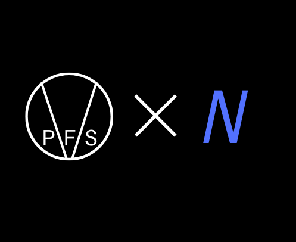

# Night

Night is a kernel developed by PFS(Peeled Fruit Studios)

It is somewhat Unix compliant but not fully.

Is is not linux nor is it posix compliant.'

Think of it as a mix between linux and windows.

# Contributing

If You feel like adding something, Go right ahead. Whether it is a new feature or a pull request, I will gladly accept any help whatsoever.
If you want to help but don't know how, check out the project board. I will get back to you in about an hour.

**Copyright (c) 2020 Peeled Fruit Studios and Night Developers, All Rights Reserved.**
